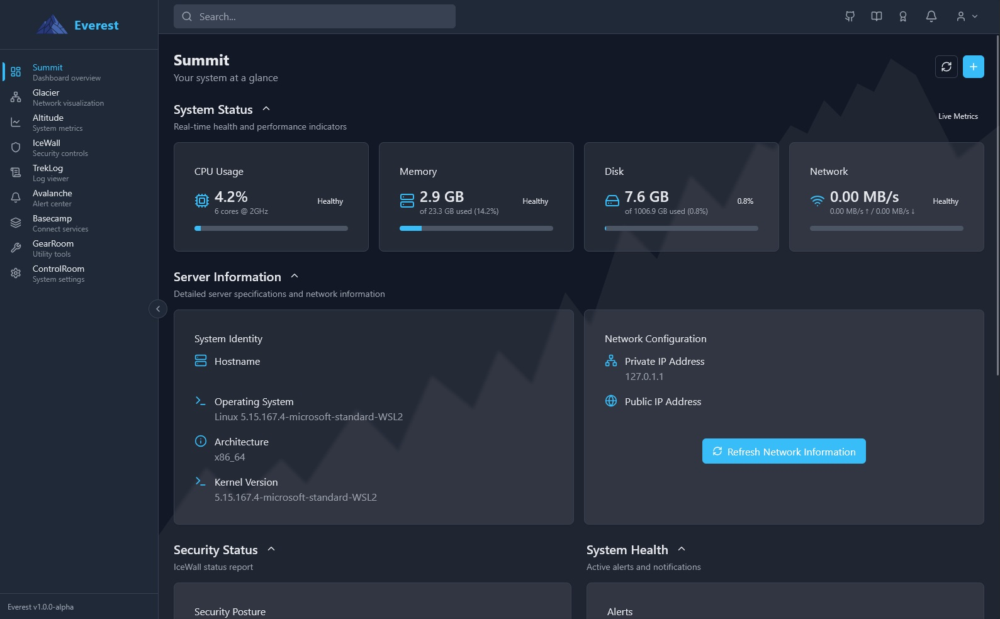

# Everyst - Server Management Dashboard


## Hey there, welcome to Everyst

Everyst is a server monitoring and security management platform built with React, TypeScript, and Django. It aims to provide a modern, responsive interface for monitoring system metrics and security.



**Important note:** This project is currently in **Alpha 1** stage. It's very much a work in progress, and I'm sharing it early to gather feedback and collaborate with others interested in this space.

## Why Everyst Exists

I’m building Everyst a server management dashboard that’s simple, fast, and secure. I wasn’t happy with existing options like Webmin or Cockpit (they felt slow or outdated) so I decided to make something better.

Everyst uses React, TypeScript, and Django to give a clean and responsive interface for monitoring system metrics and managing security. It’s still early days (Alpha stage), but the goal is to have a reliable tool that works well for my homelab and anyone else who wants something lightweight and modern.

## Technical Foundation

Everyst is built on:

### Frontend

React + TypeScript + Vite with Tailwind CSS for responsive design

### Backend

Django + Socket.IO for API endpoints and real-time updates

## Getting Started

Want to play around with the project? Here's how:

### Prerequisites

- Node.js 18+ and npm
- Python 3.10+
- Virtual environment tool (venv recommended)
- curl

### Installation

We provide two scripts to help you get Everyst up and running: one for a production-like server setup and one for local development if you wish to contribute or modify the code.

#### Production Installation (Not Recommended)

WARNING: This isn't really ready, I wouldn't recommend installing yet. NOT stable. Please use the development setup instructions below instead.

This script prepares Everyst for a production-like environment. It creates a dedicated system user (`Everyst`), builds the frontend for production, and sets stricter file permissions.

1. Clone the repository:

   ```bash
   git clone https://github.com/Jordonh18/Everyst.git
   cd Everyst
   ```

2. Run the production installation script with sudo privileges:

   ```bash
   sudo ./install.sh
   ```

   The script will:
   - Perform prerequisite checks.
   - Create a system user named `Everyst`.
   - Set up the Python virtual environment.
   - Install backend and frontend dependencies.
   - Run database migrations.
   - **Build the frontend for production (`npm run build`)**.
   - Set file ownership and permissions for the `Everyst` user (this user will own the application files, database, etc.).
   - Optionally, create a systemd service file to manage the Everyst application.

   Follow the on-screen prompts and messages for further instructions, especially regarding the systemd service and production Django settings.

#### Development Setup (For contributing or local modification)

If you'd like to contribute to Everyst or set up a local development environment to modify the code, this script will help you get started. It installs necessary dependencies and configures file permissions for your user.

**Note:** For deploying on a server, please use the Production Installation script above.

1. Clone the repository (if not already done):

   ```bash
   git clone https://github.com/Jordonh18/Everyst.git
   cd Everyst

2. Set up your environment variables:

   ```bash
   cp .env.example .env
   ```

   Then edit the `.env` file to customize your settings. See [Environment Variables Guide](docs/getting-started/environment-variables.md) for details.
   ```

3. Run the development setup script with sudo privileges:

   ```bash
   sudo ./setup-dev.sh
   ```

   The script will:
   - Check for and optionally install prerequisites (Python 3.10+, Node.js 18+, npm, curl).
   - Create a Python virtual environment (`venv`).
   - Install backend dependencies (`requirements.txt`).
   - Run database migrations.
   - Install frontend dependencies (`package.json`).
   - Set appropriate file ownership and permissions for development (e.g., your user will own the database file).

4. After the script completes, activate the virtual environment:

   ```bash
   source venv/bin/activate
   ```

5. Start the development server:

   ```bash
   sudo npm run dev
   ```

6. Access the application at `https://localhost:5173`

   Both the frontend and backend are configured to use HTTPS with the certificates in the `certs` folder. Since we're using self-signed certificates for development, you may need to accept the security warnings in your browser.

## Contributions Welcome

I'd love your help with this project! It's in its early days, and contributions of all kinds are welcome.

Feel free to:

- Submit issues for bugs you find
- Suggest features you'd like to see
- Fork the repo and submit pull requests
- Share feedback on the current implementation

No contribution is too small, and all are appreciated.

Commenting your code clearly is essential — it saves time and ensures everyone (including me!) can understand the purpose and logic quickly.

## Credits

### Logo Design
The Everyst logo was designed by Katie McKinlay. Their creative contribution has been essential to establishing the visual identity of this project, and I'm incredibly grateful for their work.

### Contributors
Thanks to all who have contributed to making Everyst better!

## ☕ Support

If you find this project useful, consider [buying me a beer](https://www.buymeacoffee.com/jordonh) to support continued development.


## License

This project is licensed under the GPL-3.0 license - see the LICENSE file for details.
